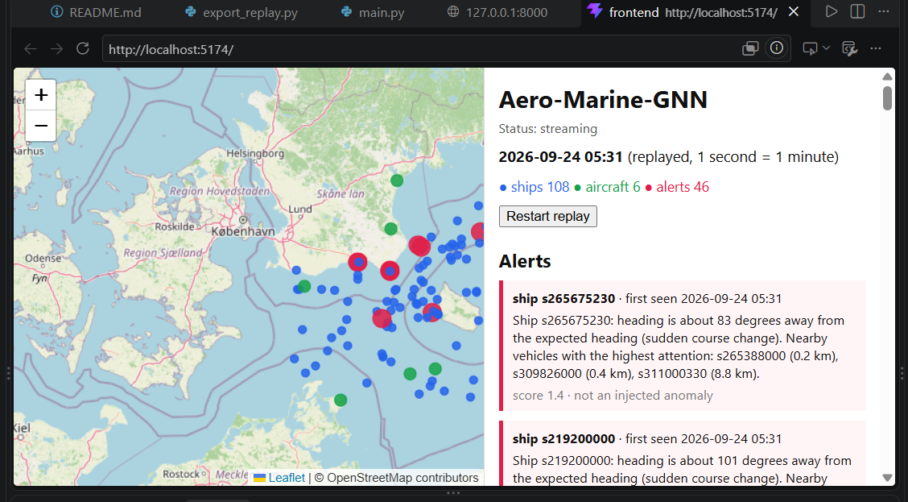
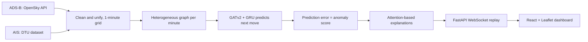

# Aero-Marine-GNN

A unified heterogeneous graph neural network prototype for detecting anomalies in air (ADS-B) and maritime (AIS) traffic, with plain-language alert explanations and a live replay dashboard.

*ABESEC Ghaziabad, Department of CSE, final-year project (session 2026-27).*



## Team
- Garima Singh Parihar
- Harsh Singh Chauhan
- Divyanshi Bharadwaj

Guide: Ms. Shivani Trivedi, ABESEC Ghaziabad

## How it works



- **Graph:** ships and aircraft are nodes. Nearby vehicles are connected (ship-ship 10 km, aircraft-aircraft 50 km, air-sea 20 km).
- **Model:** two GATv2 layers per edge type, then a GRU over the last 5 minutes. It predicts a correction to a constant-velocity guess for the next minute (position change and heading).
- **Training:** self-supervised, on normal data only. No labelled anomalies are needed.
- **Alerts:** a vehicle is flagged when its prediction error exceeds the 99th percentile of validation error for its type.
- **Explanations:** a text template filled with the largest deviation (jump, course change, speed change) and the neighbours with the highest attention.

## Results (synthetic anomalies, test period)

AUROC per vehicle type (0.5 = guessing, 1 = perfect):

| | Constant velocity | Sea-only GNN | Air-only GNN | Unified GNN |
|---|---|---|---|---|
| Ships | 0.69 | 0.87 | - | 0.85 |
| Aircraft | 0.84 | - | 0.85 | 0.84 |

Share of injected events detected:

| Anomaly | Vehicle | Constant velocity | Sea-only | Air-only | Unified |
|---|---|---|---|---|---|
| Course change | ship | 0.85 | 0.85 | - | 0.90 |
| Course change | aircraft | 0.75 | - | 0.75 | 0.75 |
| Speed change | ship | 0.30 | 0.45 | - | 0.45 |
| Speed change | aircraft | 0.38 | - | 0.50 | 0.75 |
| Spoofed jump | ship | 1.00 | 1.00 | - | 1.00 |
| Spoofed jump | aircraft | 0.50 | - | 0.62 | 0.62 |
| Ship-ship meeting | ship | 0.06 | 0.44 | - | 0.25 |
| Air-sea loiter | aircraft | 0.00 | - | 0.00 | 0.33 |

**Main finding:** the unified model matched, but did not clearly beat, single-domain GNNs overall. Learned models were much better than the constant-velocity baseline on ships. The only event type where only the unified model detected anything was the air-sea loiter, but there were just 3 such events, so this result should be treated as preliminary, not conclusive.

## Limitations

- All anomalies are synthetic and injected into the test data.
- Ships come from a 2021 AIS dataset and aircraft from a September 2026 recording; the two were time-aligned artificially, so ships and aircraft did not really share the same day.
- One region and a short period (about 15 hours of overlap), so few events per anomaly type (8 aircraft events per kind, 3 air-sea events). Small differences are within noise; one random seed was used.
- In normal traffic, air and sea vehicles do not influence each other, so a next-step predictor has little reason to use air-sea links. Anomalies that keep each vehicle's motion normal and only make the *relationship* unusual are not detectable with this scoring.
- Attention weights are hints about what the model looked at, not proof of cause.
- The dashboard replays recorded data; it is not a production real-time system.

## Data

- **ADS-B:** recorded with `src/record_adsb.py` from the OpenSky Network API.
  Data retrieved from the OpenSky Network, https://opensky-network.org
- **AIS:** DTU AIS dataset (`data/raw/ais_dtu`), 13 Dec 2021.
  **UNLABELLED DATA** Olesen, Kristoffer Vinther; Clemmensen, Line Katrine Harder; Christensen, Anders Nymark (2023). Unlabelled training datasets of AIS Trajectories from Danish Waters for Abnormal Behavior Detection. Technical University of Denmark. Dataset. https://doi.org/10.11583/DTU.21511842.v1
  **LABELLED DATA** Olesen, Kristoffer Vinther; Clemmensen, Line Katrine Harder; Christensen, Anders Nymark (2023). Labelled evaluation datasets of AIS Trajectories from Danish Waters for Abnormal Behavior Detection. Technical University of Denmark. Dataset. https://doi.org/10.11583/DTU.21511815.v1
- `data/`, `models/*.pt` and `credentials.json` are not fully included in the repository (trained model weights and replay.json are included; raw/processed intermediate data is not, due to size). Create your own `credentials.json` for OpenSky if you record data.

## Run it

```bash
python -m venv .venv
.venv\Scripts\activate          # Windows
pip install -r requirements.txt

python src/record_adsb.py       # leave running for 24 hours or more, then stop
python src/convert_ais.py
python src/step2_clean.py
python src/step3_graphs.py
python src/step4_model.py       # set OVERFIT_TEST = False for the real run
python src/step5_eval.py
python src/inject.py
python src/train_variant.py sea
python src/train_variant.py air
python src/compare.py
python src/explain.py
python src/export_replay.py
```

Dashboard, without Docker (two terminals):

```bash
uvicorn backend.main:app --reload          # terminal 1, from the project root
cd frontend && npm install && npm run dev  # terminal 2, then open http://localhost:5173
```

Dashboard, with Docker:

```bash
docker compose up --build                  # then open http://localhost:8080
```

## Repository layout

`src/` pipeline scripts, `backend/` FastAPI replay server (with `replay.json`), `frontend/` React + Leaflet dashboard, `notebooks/` experiments.

## Reproducing the full pipeline

Processed intermediate data (graphs, cleaned CSVs) is not included in this repo due to size (~200MB).
To retrain from scratch, download it from our shared Drive folder, or run `src/step2_clean.py` through `src/step5_eval.py` on your own AIS/ADS-B data.

<!-- TODO: replace this line with your real shared Google Drive folder link -->
Drive folder: **https://drive.google.com/drive/folders/1PyQkQ55uyujdR0a-o29uIu3OZ86cKBrZ?usp=drive_link**